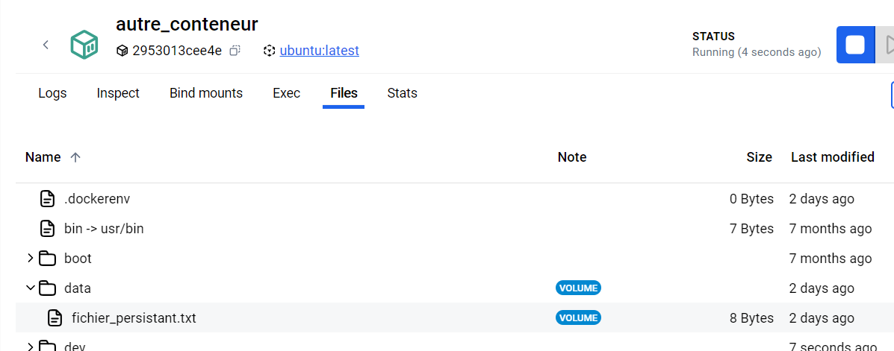

# Initiation à Docker

## Phase 1 : Veille et Installation
voir la [veille technique](veille_docker.pdf)

## Phase 2 : Création et Gestion de Conteneurs
Après avoir ouvert un terminal dans VisualCode, on peut utiliser les commandes suivantes pour :
* Lancez un conteneur Ubuntu en mode interactif et explorez les commandes Linux dans ce conteneur
```
docker run -it ubuntu

mkdir mon_dossier               # Créer un dossier
touch mon_dossier/mon_fichier   # Créer un fichier
ls -la                          # Lister les fichiers et répertoires
```

* Exécuter une commande dans un conteneur en cours d’exécution
```
docker exec mon_conteneur ls /
```

* Récupérer les logs d’un conteneur et supprimer un conteneur arrêté
```
docker stop mon_conteneur # Arrêter le conteneur
docker rm mon_conteneur   # Supprimer le conteneur
```

* Monter un volume dans un conteneur et créer un fichier dans le volume pour observer la persistance des données après l’arrêt du conteneur
```
docker volume create mon_volume                                      # Création du volume
docker run -it --name conteneur_volume -v mon_volume:/data ubuntu    # Création d'un fichier data dans le volume
echo "Bonjour" > /data/fichier_persistant.txt                        # Ajout d'un fichier texte dans le volume
exit
docker run -it --name autre_conteneur -v mon_volume:/data ubuntu     # Création d'un second conteneur avec le même volume
```
En regardant dans les files des deux conteneurs dans le Docker Desktop, on retrouve bien le dossier data avec le fichier texte créé dans chacun des conteneurs:


* Créer un réseau Docker et connectez deux conteneurs. Testez la communication entre eux avec une commande simple, comme ping.
```
docker network create mon_reseau                                              # Création du réseau
docker run -d --name serveur --network mon_reseau ubuntu tail -f /dev/null    # Création du premier conteneur
docker run -d --name client --network mon_reseau ubuntu tail -f /dev/null     # Création du second conteneur
```
​Attention!! ping n'existe pas sur Ubuntu! il est nécessaire d'installer iputils-ping
```
apt update
apt install -y iputils-ping
```
On peut ensuite utiliser ping avec la commande :
```
docker exec client ping serveur
```

## Phase 3 : Création d’Images et Déploiement d’Application
* Création d'un [Dockerfile](dockerfile) pour créer une image de base Python
* Création d'un fichier [requirements](requirements.txt)
* Création d'une application Flask dans un fichier [app.py](app.py)
* Construction de l'image avec la commande docker build
```
docker build -t mon_image_flask .
```
* Exécution du conteneur puis test de l'application en local
```
docker run -d -p 5000:5000 --name mon_conteneur_flask mon_image_flask
```
Attention à bien vérifier que le conteneur est actif, puis se connecter à [localhost:5000](http://localhost:5000).
​
## Phase 4 : Projet de Déploiement en Conditions Réelles
Mettez un modèle en conteneur avec Docker et exposez une API pour effectuer des prédictions. (Brief précédent)
Configurez un volume pour stocker les données de requêtes (par ex., sauvegarder les prédictions et les résultats)
